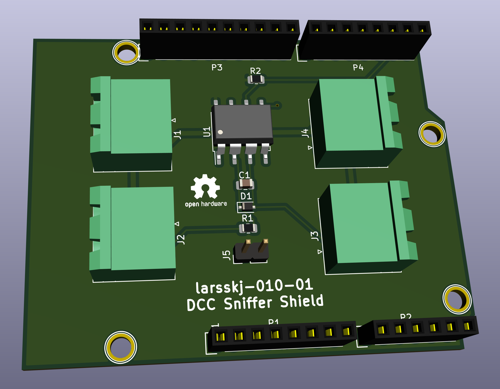

DCC Sniffer Shield for Arduino Uno 
==================================

### larsskj-010

This is an Arduino Uno shield that can be used as a model railroad DCC packet sniffer. The board holds four pluggable terminal blocks to distribute track power, and an optocoupler that enables the Arduino to monitor DCC traffic.

A couple of pins can be added to easily connect oscilloscopes, protocol analyzers, etc.

The circuitry is based on an article by Neil McKechnie found on [Neil's Blog](https://wakwak2popo.wordpress.com/2020/12/11/dcc-sniffer/).

Using this shield you can get a nice packet sniffer dumping DCC packets to the Arduino USB port using the code found in the [DCCInspector-EX](https://github.com/DCC-EX/DCCInspector-EX) Github repository.

For more information, visit the [project homepage](https://larsskj.org/projects/larsskj-010).

The files provided are project files for [KiCad 5](http://kicad-pcb.org/).

